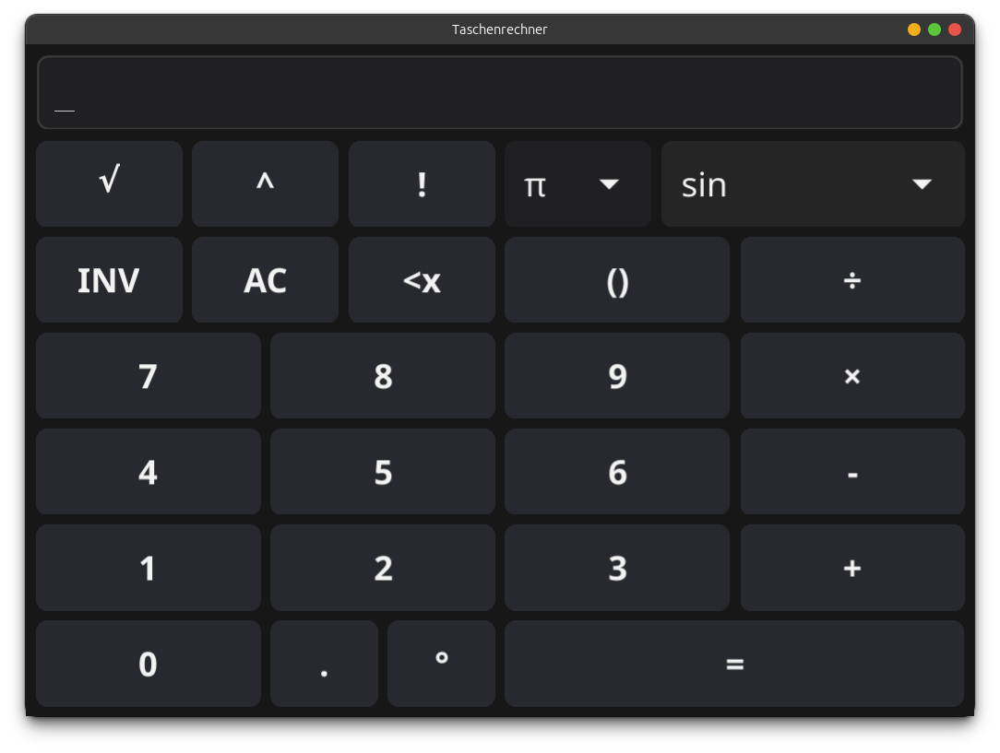

[](https://github.com/sarumaj/edu-taschenrechner/actions/workflows/deploy.yml)
[](https://goreportcard.com/report/github.com/sarumaj/edu-taschenrechner)
[](https://codeclimate.com/github/sarumaj/edu-taschenrechner/maintainability)
[](https://pkg.go.dev/github.com/sarumaj/edu-taschenrechner)
[](https://go.dev)

---

# taschenrechner

This is an example project to showcase how to organize application code, implement unit tests and define integrity tests using a [BDT framework](https://www.loadmill.com/blog/behavior-driven-testing-the-complete-guide-to-bdt-automation). The app is available under [taschenrechner.sarumaj.com](https://taschenrechner.sarumaj.com).



## Features

- [x] handle invalid input
  - [x] complete open brackets
  - [x] abort incomplete arithmetic operations
  - [ ] prevent invalid input (partially tested)
  - [x] in case of unforeseen exception, display NaN
- [x] memory cell
  - [x] store result in a memory cell
  - [x] retrieve and reuse last result

## Setup

To setup similar project follow following steps:

1. Create GitHub repository.
2. [Install](https://github.com/git-guides/install-git) git CLI and [authenticate](https://docs.github.com/en/authentication/keeping-your-account-and-data-secure/about-authentication-to-github) it.
3. Clone your repository:
   ```
   git clone https://github.com/[username]/[repository name]
   cd [repository name]
   ```
4. Initialize new Go module: `go mod init github.com/[username]/[repository name]`, where `github.com/[username]/[repository name]` will be your module name.
5. Start coding. Additional libraries can ben added using `go get [module name]`. Use `go mod tidy` if necessary.
6. Define unit tests and execute: `go test -v ./...`
7. Execute: `go run [program entrypoint file]`
8. Build: `go build [program entrypoint file]`
9. Utilize version control:
   1. Status check: `git status`
   2. Pull: `git pull`
   3. Stage and commit:
      ```
      git add .
      git commit -m "[your commit message goes here]"
      ```
   4. Push: `git push`
   5. Advanced usage:
      1. Create a temporary branch: `git checkout -b [branch name]`
      2. Pull, stage, commit
      3. Push: `git push --set-upstream origin [branch name]`
      4. Create pull request and merge it through the web interface ([github.com](github.com))

## Application structure

- [entrypoint main.go](main.go)
- [test suite for entrypoint main_test.go](main_test.go)
- [module file go.mod](go.mod)
- [package pkg](pkg)
  - [package cursor](pkg/cursor)
    - [unit test file cursor_test.go](pkg/cursor/cursor_test.go)
    - [code file cursor.go](pkg/cursor/cursor.go)
  - [package memory](pkg/memory)
    - [code file memory.go](pkg/memory/memory.go)
  - [package runes](pkg/runes)
    - [unit test file sequence_test.go](pkg/runes/sequence_test.go)
    - [code file sequence.go](pkg/runes/sequence.go)
    - [code file utils.go](pkg/runes/utils.go)
  - [package ui](pkg/ui)
    - [code file app.go](pkg/ui/app.go)
    - [code file button.go](pkg/ui/button.go)
    - [code file display.go](pkg/ui/display.go)
    - [code file theme.go](pkg/ui/theme.go)
- [directory go-test](go-test)
  - [directory features](go-test/features)
    - [BDT feature file example.feature](go-test/features/example.feature)

The [application entrypoint](main.go) makes use of the [package ui](pkg/ui). The import path is always the module name followed by the package path, e.g.

| Property    | Value                                    |
| ----------- | ---------------------------------------- |
| Module name | github.com/sarumaj/taschenrechner        |
| Package     | pkg/ui                                   |
| Import path | github.com/sarumaj/taschenrechner/pkg/ui |

The app utilizes following frameworks:

- [Fyne](https://fyne.io) for frontend development
- [Goval](github.com/maja42/goval) to parse and evaluate arithmetic expressions in the backend

As for the BDT testing the [Cucumber](https://cucumber.io) framework and its Go implementation ([Godog](https://github.com/cucumber/godog)) are being used.

The [unit test file sequence_test.go](pkg/runes/sequence_test.go) provides an example on how to write context-aware and well documented unit tests.

The [unit test file cursor_test.go](pkg/cursor/cursor_test.go) provides an example on how to write context-aware and compact unit tests (reduced number of lines).

The [test suite for entrypoint main_test.go](main_test.go) defines the feature steps parsed by the test engine:

- `^I press following buttons: "([^"]*)"$`
- `^I get following result: "([^"]*)"$`

The [BDT feature file example.feature](go-test/features/example.feature) defines few test scenarios making use of the aforementioned feature steps.
